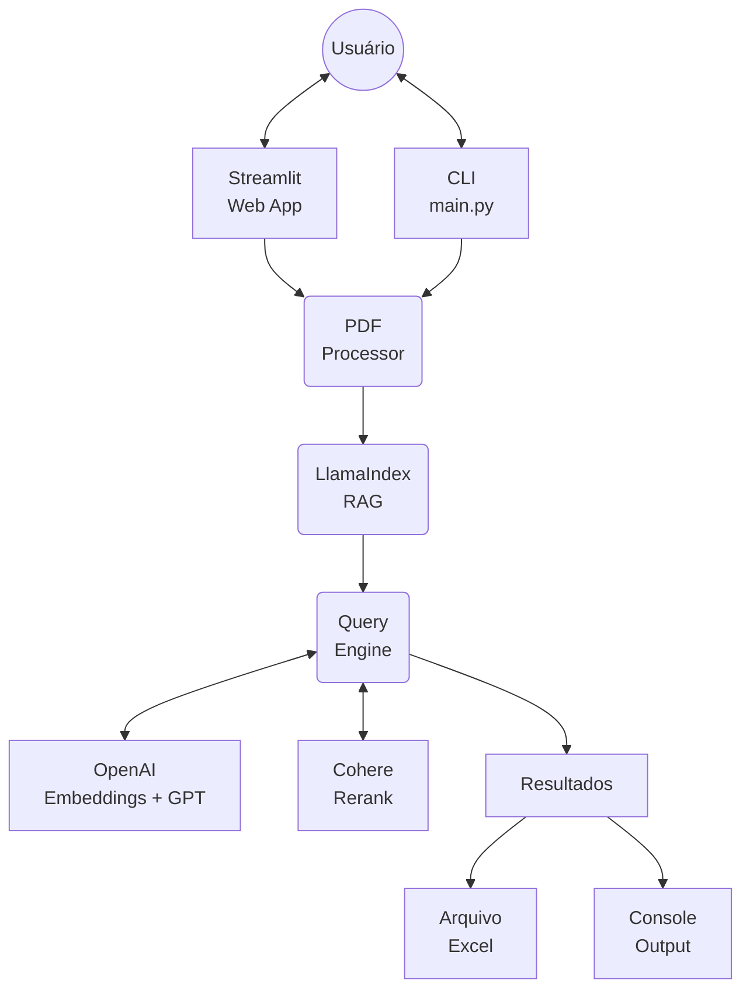

# FabricIA

Agente inteligente para processamento e análise de laudos de avaliação em PDF, extraindo informações estruturadas e gerando planilhas Excel.

## 🔄 Arquitetura do Sistema



### Componentes

- **Interfaces**: Streamlit Web App e CLI para entrada de PDFs
- **PDF Processor**: Valida e extrai texto dos laudos
- **LlamaIndex RAG**: Pipeline de indexação vetorial e recuperação
- **Query Engine**: Motor de consulta com reranking inteligente
- **Serviços Externos**: OpenAI (embeddings/LLM) e Cohere (reranking)
- **Outputs**: Excel estruturado ou saída no console

## 📋 Funcionalidades

- **Upload de PDF**: Interface web para upload de laudos de avaliação
- **Extração Inteligente**: Usa RAG (Retrieval-Augmented Generation) para extrair informações específicas
- **Perguntas Pré-configuradas**:
  - Nome da empresa avaliada
  - Nome da empresa avaliadora
  - Data do laudo
  - Metodologias de avaliação utilizadas

## 🚀 Como Usar

### Interface Web (Streamlit)

```bash
streamlit run run_app.py
```

### CLI

```bash
python main.py
```

## 🛠️ Tecnologias

- **LlamaIndex**: Framework RAG
- **OpenAI**: Embeddings e LLM (GPT-4)
- **Cohere**: Reranking de resultados
- **Streamlit**: Interface web
- **PyPDF2**: Extração de texto de PDFs
- **Pandas**: Manipulação de dados
